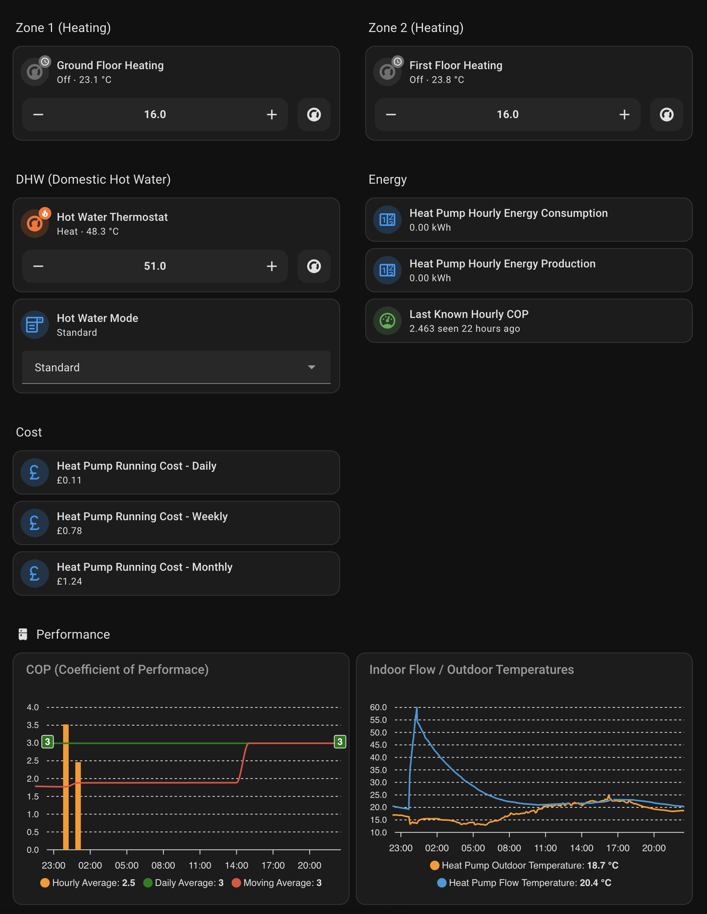

# ESPHome / Home Assistant Samsung Heat Pump Integration

This component enables Samsung Heat Pumps to be integrated into ESPHome and Home Assistant. It supports NASA heat pumps that utilize the MIM-E03CN / MIM-E03DN & MIM-E03EN control boards (e.g., Samsung Gen 6 heat pump etc). Older non-NASA systems are not supported. 

The project requires a suitable RS485 Modbus enabled board such as the M5Stack Atomic RS485 Base (https://shop.m5stack.com/products/atomic-rs485-base) with the Atom Lite (https://shop.m5stack.com/products/atom-lite-esp32-development-kit). But any ESPHome supported board with a TTL-RS485 converter should theoretically work. Modbus A connects to F2 and Modubs B connects to F1 on the MIM control board. F1 & F2 are the connectors used for communication betweeen the internal unit/MIM board and the external heat pump unit. F3 & F4 are the connectors used by the wired LCD touch controllers. 

This project borrows from the excellent work done by the team supporting the ESPHome Samsung HVAC Integration (https://github.com/omerfaruk-aran/esphome_samsung_hvac_bus/). The project includes detailed [hardware installation instructions](https://github.com/omerfaruk-aran/esphome_samsung_hvac_bus/wiki/Hardware-Installation) on the installation process so I won't repeat them here.

Most of the useful controls for DHW (domestic hot water), and heating (single and 2-zone) are supported by this component - along with the ability to read and write FSVs (Field Setting Values). The project has been re-engineered to abstract away the NASA message codes from the C++ code so it should be much easier to add missing controls to the Python lists of ESPHome components (lists, numbers, selects, sensors etc). This should make it much easier to submit PRs for missing NASA messages.

All commands, and FSVs are implemented as standard ESPHome components (e.g., lists, numbers, selects, switches, sensors). Check out the [example.yaml](example.yaml).

## Basic Controller, NASA Client & Device Configuration  

```yaml
samsung_nasa:
  debug_log_messages: false
  debug_log_undefined_messages: false
  nasa_client: {}
  devices:
   - address: 20.00.00
     id: nasa_device_1
   - address: 10.00.00
     id: nasa_device_2
```

20.00.00 would normally be the address of the indoor unit; 10.00.00 would be the address of the outdoor unit (heat pump). It's best to leave the nasa_client options empty (at their defaults) as the client has been tested with these default values. You will need to provide an id for each device so you can associate each device with an ESPHome component.

## Advanced Controller, NASA Client & Device Configuration  

```yaml
samsung_nasa:
  debug_log_messages: false
  debug_log_undefined_messages: false
  nasa_client:
    silence_interval: 100
    retry_interval: 500
    min_retries: 1
    send_timeout: 1000
    flow_control_pin: GPIOXX
  devices:
   - address: 20.00.00
     id: nasa_device_1
   - address: 10.00.00
     id: nasa_device_2
```

The nasa_client configuration options are to do with ensuring NASA message delivery via a retry mechansim. Thanks and acknowledgment go to atanasenko for the [retry mechanism.](https://github.com/omerfaruk-aran/esphome_samsung_hvac_bus/commit/1030af3bcc4f3dc688be643e0c2ae65b6401fcc5)

 - **silence_interval**: (Optional) The time to wait since the last wire activity before sending. 
 - **retry_interval**: (Optional) The minimum time before a retry attempt.  
 - **min_retries**: (Optional) The minimum number of retries, even beyond timeout. 
 - **send_timeout**: (Optional) The maximum time to wait before discarding commands.  
 - **flow_control_pin**: (Optional) The pin used to switch flow control. This is useful for RS485 transceivers that do not have automatic flow control switching, like the common MAX485.

## Number  

Commands and FSVs are implemented as number components when they represent a range of values such as temperature, duration etc. For commands use the message option with the NASA hex code; for FSVs use the fsv field:

```yaml
number:
  - platform: samsung_nasa
    message: 0x4201
    name: "Zone 1 Target Temp"
    internal: true
    nasa_device_id: nasa_device_1
    id: zone_target_temp

  - platform: samsung_nasa
    fsv: 2011
    nasa_device_id: nasa_device_1
    name: "Water Law (Outdoor Temp) High"
    id: fsv_2011
```

These are the only fields you need to provide. All other fields such as unit of measure, decimal accuracy etc are automatically configured based on the message or fsv value. Number components are read/write so in the examples above the target temperature can be read and modified; likewise the FSV (Water Law (Outdoor Temp) High) can be modified and the new value sent to the heat pump. Caution needs to be exercised with FSVs. While care has been taken to limit the values to those that are appropriate for the given FSV, there can be minor differences between control boards and permitted min/max values.

### Commands  

| NASA Code | NASA Label                        | Description                            |
|-----------|-----------------------------------|--------------------------------------- |
| 0x4201    | VAR_IN_TEMP_TARGET_F              | (Zone 1) Target Tempearature           |
| 0x4206    | VAR_IN_TEMP_TARGET_ZONE2_F        | (Zone 2) Target Temperature            |
| 0x4235    | VAR_IN_TEMP_WATER_HEATER_TARGET_F | DHW Target Temperature                 |
| 0x4247    | VAR_IN_TEMP_WATER_OUTLET_TARGET_F | Water Outlet Target Temperature.       |

### FSVs  

Refer to p.24 onwards of the [MIM-E03EN user manual PDF](MIM-E03EN.pdf).

1011, 1012, 1021, 1022, 1031, 1032, 1041, 1042, 1051, 1052, 2011, 2012, 2021, 2022, 2031, 
2032, 2051, 2052, 2061, 2062, 2071, 2072, 3021, 3022, 3023, 3024, 3025, 3026, 3032, 3033,
3043, 3044, 3045, 3052, 3046, 3081, 3082, 3083, 4012, 4013, 4024, 4025, 4033, 4042, 4043, 
4044, 4045, 4046, 4052, 4053, 5011, 5013, 5014, 5015, 5016, 5017, 5018, 5019, 5021, 5023,
5082, 5083, 5092, 5093


You can find a list of supported commands and FSVs in the [python configuration file for number components.](/components/samsung_nasa/nasa/numbers.py)

For example here are the python entries for the above number components:

```python
numbers = {
    0x4201: {
        NASA_LABEL: "VAR_IN_TEMP_TARGET_F",
        NASA_MODE: CONTROLLER_MODE_CONTROL,
        CONF_DATA: cmd_numeric_data(16, 30),
        CONF_DEFAULTS: temperature_defaults()
    },
    0x4254: {
        NASA_LABEL: "VAR_IN_FSV_2011",
        NASA_MODE: CONTROLLER_MODE_FSV,
        CONF_DATA: fsv_numeric_data(2011, -20, 5),
        CONF_DEFAULTS: temperature_defaults()
    }
}

```

## Select  

```yaml
select:
  - platform: samsung_nasa
    message: 0x4066
    nasa_device_id: nasa_device_1
    name: Hot Water Mode
    id: hotwater_mode
```

The correct options for select components are automatically configured. You can find a list of supported select components and FSVs in the [python configuration file](/components/samsung_nasa/nasa/selects.py) that is used to auto generate the select component.

So for example message 0x4066 (hot water mode):

```python
0x4066: {
    NASA_LABEL: "ENUM_IN_WATER_HEATER_MODE",
    NASA_MODE: CONTROLLER_MODE_CONTROL,
    CONF_DATA: cmd_select_data(
        [
            "Economy", 
            "Standard", 
            "Power", 
            "Force"
        ]
    ),
    CONF_DEFAULTS: select_defaults()
}
```

### Commands  

| NASA Code | NASA Label                        | Description                            |
|-----------|-----------------------------------|--------------------------------------- |
| 0x4001    | ENUM_IN_OPERATION_MODE            | Operation mode (eg. Auto, Heat, Cool)  |
| 0x4066    | ENUM_IN_WATER_HEATER_MODE         | DHW mode (eco, standard, power, force) |
| 0x4235    | VAR_IN_TEMP_WATER_HEATER_TARGET_F | DHW Target Temperature                 |

### FSVs  

Refer to p.24 onwards of the [MIM-E03EN user manual PDF](MIM-E03EN.pdf).

2041, 2081, 2091, 2092, 2093, 3011, 3042, 3061, 3071, 4011, 4021, 4022, 4041, 4051, 4052, 4053


## Switch  

Binary type NASA commands and FSV values (such as ON/OFF, YES/NO, ENABLED/DISABLED) are represented as switches. Like Number and Select componentes, they are read/write.

```yaml
switch:
  - platform: samsung_nasa
    message: 0x4065
    nasa_device_id: nasa_device_1
    name: "DHW Power"
    internal: true
    id: dhw_power_switch
  - platform: samsung_nasa
    message: 0x4000
    nasa_device_id: nasa_device_1
    name: "Zone 1 Power"
    internal: true
    id: zone_power
```
 
 A list of available switches can be found in [switches.py](/components/samsung_nasa/nasa/switches.py) which is used to auto configure the switch components.

```python
switches = {
    0x4065: {
        NASA_LABEL: "ENUM_IN_WATER_HEATER_POWER",
        NASA_MODE: CONTROLLER_MODE_CONTROL,
        CONF_DATA: empty_data(),
        CONF_DEFAULTS: bool_defaults()
    },    
    0x4000: {
        NASA_LABEL: "ENUM_IN_OPERATION_POWER",
        NASA_MODE: CONTROLLER_MODE_CONTROL,
        CONF_DATA: empty_data(),
        CONF_DEFAULTS: bool_defaults()
    },
}
```

### Commands  

| NASA Code | NASA Label                          | Description                            |
|-----------|-------------------------------------|--------------------------------------- |
| 0x4065    | ENUM_IN_WATER_HEATER_POWER          | DHW On/Off control                     |
| 0x4000    | ENUM_IN_OPERATION_POWER             | Zone 1 heating On/Off control          |
| 0x411E    | ENUM_IN_OPERATION_POWER_ZONE2.      | Zone 2 heating On/Off control          |
| 0x4111    | ENUM_IN_OPERATION_AUTOMATIC_CLEANING| Turn on/off automatic cleaning         |

### FSVs  

Refer to p.24 onwards of the [MIM-E03EN user manual PDF](MIM-E03EN.pdf).

3031, 3041, 3051, 4023, 4031, 4032, 4061, 5022, 5041, 5051, 5081, 5091, 5094  


## Sensor   

Sensor components are read-only. They report real-time data such as room temperature, energy consumption/production and valve/pump status.

```yaml
sensor:
  - platform: samsung_nasa
    message: 0x4237
    nasa_device_id: nasa_device_1
    name: "DHW Temperature"
    internal: true
    id: hot_water_current_temp
```

In addition to a large selection of available sensors, it is also possible to specify your own NASA code should it not be listed in [sensors.py](/components/samsung_nasa/nasa/sensors.py). You will need to provide the appropriate unit of measure, device class, decimal accuracy and lambdas to transform the raw NASA value to something meaningful. Consult the [ESPHome documentation](https://esphome.io/components/sensor/) for how to configure a sensor component. As part of the samsung_nasa platform you will need to specify message, nasa_device_id and platform fields.

Here is the python entry that configures the above sensor:

```python
0x4237: {
    NASA_LABEL: "VAR_IN_TEMP_WATER_TANK_F",
    NASA_MODE: CONTROLLER_MODE_STATUS,
    CONF_DEFAULTS: temp_sensor_defaults()
},
```

| NASA Code | NASA Label                        | Description                            |
|-----------|-----------------------------------|--------------------------------------- |
| 0x24FC    | LVAR_NM_OUT_SENSOR_VOLTAGE        | Heat pump voltage                      |
| 0x4038    | ENUM_IN_STATE_HUMIDITY_PERCENT    | Only available with A/C units          |
| 0x4067    | ENUM_IN_3WAY_VALVE                | DHW Valve (0=heat, 1=tank)             |
| 0x4069    | ENUM_IN_THERMOSTAT1               | Zone 1 input signal from external stat |
| 0x406A    | ENUM_IN_THERMOSTAT2               | Zone 2 input signal from external stat |
| 0x4089    | ENUM_IN_STATE_WATER_PUMP          | Primary water pump status              |
| 0x408A    | ENUM_IN_2WAY_VALVE                | Zone control valve status              |
| 0x4237    | VAR_IN_TEMP_WATER_TANK_F          | DHW tank temperature                   |
| 0x4238    | VAR_IN_TEMP_WATER_OUT_F           | Water Outlet temperature               |
| 0x4203    | VAR_IN_TEMP_ROOM_F                | Zone 1 room temperature                |
| 0x4204    | VAR_IN_TEMP_ZONE2_F               | Zone 2 room temperature                |
| 0x4427    | LVAR_IN_4427                      | Heat pump produced energy Kwh          |
| 0x8204    | VAR_OUT_SENSOR_AIROUT             | Outdoor temperature                    |
| 0x8217    | VAR_OUT_SENSOR_CT1                | Outdoor Current (Amps)                 |
| 0x8235    | VAR_OUT_ERROR_CODE                | Error code (0 = OK)                    |
| 0x8413    | LVAR_OUT_CONTROL_WATTMETER_1W_1MIN_SUM | Heat pump instantaneous power     |
| 0x8414    | LVAR_OUT_CONTROL_WATTMETER_ALL_UNIT_ACCUM | Heat pump cumulative energy    |

## Automation and FSVs

Unlike NASA sensors which regularly report data without being requested, FSV values need to be requested. The samsung_nasa.request_read action enables you to request FSV values using ESPHome's powerful automation triggers and conditions. For example you can periodically request readings using ESPHome's interval component:

```yaml
interval:
  - interval: 30min
    startup_delay: 30s
    then:
      - samsung_nasa.request_read:
          id: [fsv_2011, fsv_2012, fsv_2021, fsv_2022]
```

In the above automation FSV values are read 30 seconds after startup and then every 30 minutes (or for example once a day).

Alternatively you can implement a configuration button component that when pressed will perform a read request:

```yaml
button:
  - platform: template
    name: Request
    entity_category: config
    on_press:
      - samsung_nasa.request_read:
          id: [fsv_2011, fsv_2012, fsv_2021, fsv_2022]
```

## Climate Component

The samsung_nasa platform extends to the climate component which can report current DHW (domestic hot water) temperature and room temperature if you use the Samsung wired controller as a thermostat. For DHW and heating you can control the target temperature and even bind select components to auto generate presets.

```yaml
climate:
  - platform: samsung_nasa
    name: Hot Water
    id: climate_hot_water
    power_switch_id: dhw_power_switch
    current_temp_sensor_id: hot_water_current_temp
    target_temp_number_id: hot_water_target_temp
    custom_preset_select_id: hotwater_mode
    action_mode_sensor:
      id: three_way_valve
      mappings:
        0: CLIMATE_ACTION_IDLE
        1: CLIMATE_ACTION_HEATING
    visual:
      min_temperature: 30
      max_temperature: 60
      temperature_step:
        target_temperature: 0.5
        current_temperature: 0.1
```

In the above example the climate control can report/control heat/off mode by binding the power_switch_id field to the appropriate switch component:

```yaml
switch:
  - platform: samsung_nasa
    message: 0x4065
    nasa_device_id: nasa_device_1
    name: "DHW Power"
    internal: true
    id: dhw_power_switch
```

The climate component reports hot water temperature by binding the current_temp_sensor_id to the appropriate sensor component:

```yaml
sensor:
  - platform: samsung_nasa
    message: 0x4237
    nasa_device_id: nasa_device_1
    name: "DHW Temperature"
    internal: true
    id: hot_water_current_temp
```

Likewise, target temperature can be bound to a number component for reading/modifying the desired temperature:

```yaml
number:
  - platform: samsung_nasa
    message: 0x4235
    name: DHW Target Temperature
    internal: true
    nasa_device_id: nasa_device_1
    id: hot_water_target_temp
```
If you are feeling adventurous you can even have the climate component report current action of the heat pump (idle, heating, off etc) by binding the action_mode_sensor field to the appropriate pump or valve. In the above example NASA code 0x4067 is the code for reporting the DHW valve status (0 = room; 1 = hot water tank). When this sensor reports a value of 1 the heat pump is actively heating the hot water tank.

```yaml
sensor:
    # 0x4067
    # 0 = room; 1 = tank
  - platform: samsung_nasa
    message: 0x4067
    nasa_device_id: nasa_device_1
    name: "3-Way Valve"
    internal: true
    id: three_way_valve 

climate:
  - platform: samsung_nasa
    name: Hot Water
    id: climate_hot_water
    power_switch_id: dhw_power_switch
    current_temp_sensor_id: hot_water_current_temp
    target_temp_number_id: hot_water_target_temp
    custom_preset_select_id: hotwater_mode
    action_mode_sensor:
      id: three_way_valve
      mappings:
        0: CLIMATE_ACTION_IDLE
        1: CLIMATE_ACTION_HEATING
```

Finally you populate the climate component's presets from a select component. In this example the NASA code 0x4066, which is implemented as a select component, is bound to the climate's custom_preset_select_id field.


```yaml
select:
  - platform: samsung_nasa
    message: 0x4066
    nasa_device_id: nasa_device_1
    name: Hot Water Mode
    id: hotwater_mode
```

An example heat pump dashboard in Home Assistant using this component and the example.yaml.



## Implementation Details

On startup the NASA Controller issues a read request for all configured samsung_nasa platform components. These are batched into groups of up to 10 messages and dispatched with a small time delay between each read request. The heat pump responds with a value for each NASA message so all samsung_nasa components should have an initial up-to-date value (including FSVs).

When a command is issued and successfully actioned by the heat pump, the heat pump responds with an ACK message. A read request is then issued to confirm the new value and this is reported back to the samsung_nasa platform components. Components therefore do not require optimistic: true to be set as feedback from the NASA Controller component updates the state of the component soon after the command has been issued.

A batched dispatcher is used for outgoing read requests - this automatically combines up to 10 read requests into a single payload and these batches are issued with a small delay betweeen each dispatch as a means of congestion control. There is also an outgoing queue which writes to the bus when the bus is "quiet" i.e. not currently receiving data. These two approaches combined together should hopefully minimise traffic and help reduce collisions.

## Acknowledgments

@Ianwin for founding the samsung HVAC Bus project; 
@omerfaruk-aran for maintaining the samsung HVAC project; @north3221, @matthias882, @hnykda, @Foxhill67 for technical contributions to understanding the NASA protocol. Thanks goes to @atanasenko for the much improved retry-mechanism.
